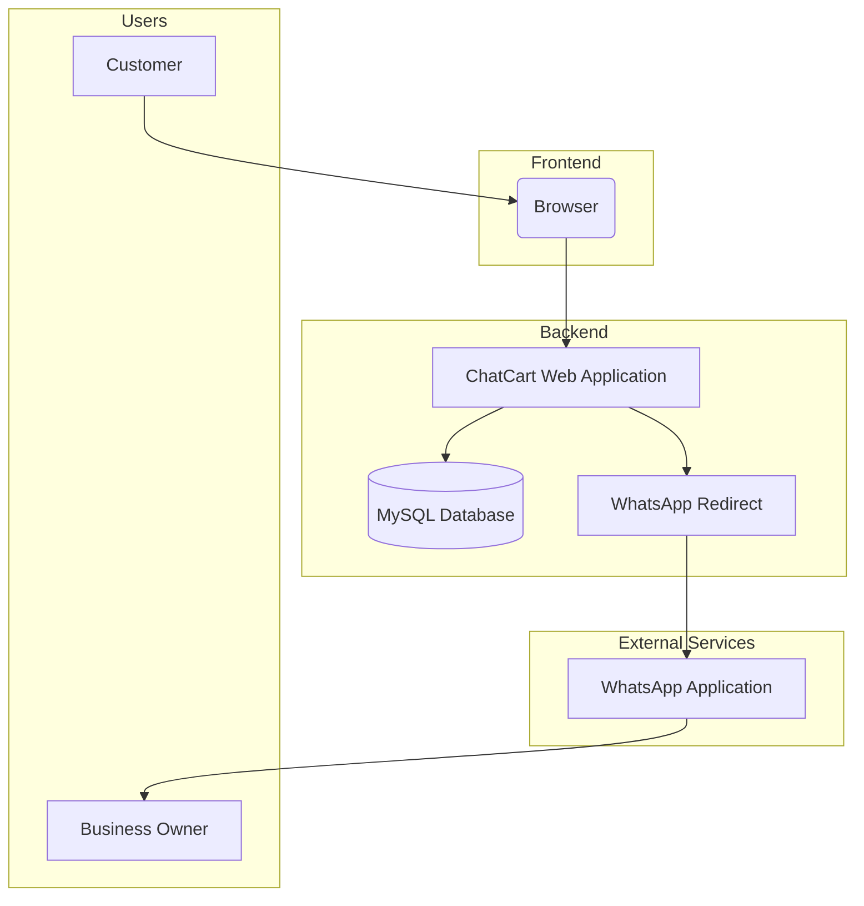

# ChatCart Web v2.0 Architecture

## System Overview



## Component Description

### 1. Frontend (Client-Side)
- **Technologies**: HTML5, CSS3, JavaScript, Bootstrap 5
- **Responsibilities**:
  - Display product catalog
  - Handle user interactions
  - Implement search and filtering
  - Generate WhatsApp links

### 2. Backend (Server-Side)
- **Technologies**: PHP 8.x, MySQL 8
- **Architecture**: Organized MVC structure
- **Security**: Prepared statements, password hashing, CSRF protection
- **API**: RESTful API for product management
- **Responsibilities**:
  - Serve web pages
  - Manage product data
  - Handle CRUD operations
  - Authentication and authorization

### 3. Data Layer
- **Storage**: MySQL database
- **Access**: PDO with prepared statements
- **Structure**: Normalized database schema with proper relationships

### 4. External Integration
- **Service**: WhatsApp
- **Integration Method**: URL redirection (`https://wa.me/`)
- **Functionality**: Pre-filled messages with product details

## Folder Structure
```
wachat/
├── modules/
│   ├── product/          # Product module
│   │   ├── controllers/  # Controller classes
│   │   ├── models/       # Model classes
│   │   └── views/        # View templates
│   ├── user/             # User module (admin)
│   │   ├── controllers/  # Controller classes
│   │   ├── models/       # Model classes
│   │   └── views/        # View templates
│   │       └── admin/    # Admin view templates
│   └── category/         # Category module
│       ├── models/       # Model classes
├── core/
│   └── shared/           # Shared components
│       ├── components/   # UI components
│       ├── config/       # Configuration files
│       ├── helpers/      # Helper functions
│       └── layouts/      # Base layout templates
├── public/               # Publicly accessible files
│   ├── index.php         # Entry point
│   ├── css/              # Stylesheets
│   ├── js/               # JavaScript files
│   └── images/           # Image files
├── database/             # Database schema and migrations
│   └── chatcart.sql      # Database dump
├── README.md             # Project documentation
└── *.html                # Legacy files (to be removed)
```

## Data Flow

1. **Customer Browsing**:
   - Customer opens website in browser
   - Browser requests public/index.php
   - Router determines which controller to use
   - Controller fetches data from models
   - Views are rendered with data
   - Browser displays product catalog

2. **Product Search/Filter**:
   - Customer enters search term or selects category
   - Request is sent to search controller
   - Controller queries database through models
   - Results are returned to view for display

3. **Order Placement**:
   - Customer clicks "Pesan via WhatsApp" button
   - Controller generates WhatsApp URL with pre-filled message
   - Browser redirects to WhatsApp application
   - Customer continues conversation with business owner

4. **Product Management**:
   - Admin logs into admin panel
   - Admin submits new product form
   - Controller validates and saves data through models
   - Database is updated
   - Success/failure response is returned

## Security Considerations

- **Data Validation**: All input is validated server-side
- **SQL Injection**: Prevented through PDO prepared statements
- **XSS Prevention**: HTML output is properly escaped
- **Password Security**: Passwords are hashed using `password_hash()`
- **CSRF Protection**: To be implemented with tokens
- **File Uploads**: To be implemented with proper validation

## Scalability

- **Current Capacity**: Suitable for small to medium catalogs (up to 10,000 products)
- **Performance**: Optimized with database indexing
- **Upgrade Path**: Can be enhanced with caching (Redis/Memcached)

## Future Enhancements

1. **Caching**:
   - Add Redis/Memcached for faster data retrieval
   - Implement browser caching for static assets

2. **Advanced Analytics**:
   - Track product views and clicks
   - Implement basic business analytics

3. **Multi-language Support**:
   - Add language selection
   - Implement translation system

4. **Payment Integration**:
   - Add digital payment options
   - Integrate with payment gateways

5. **Inventory Management**:
   - Advanced stock control features
   - Low stock alerts

6. **Order Tracking**:
   - Basic order status management
   - Customer notifications